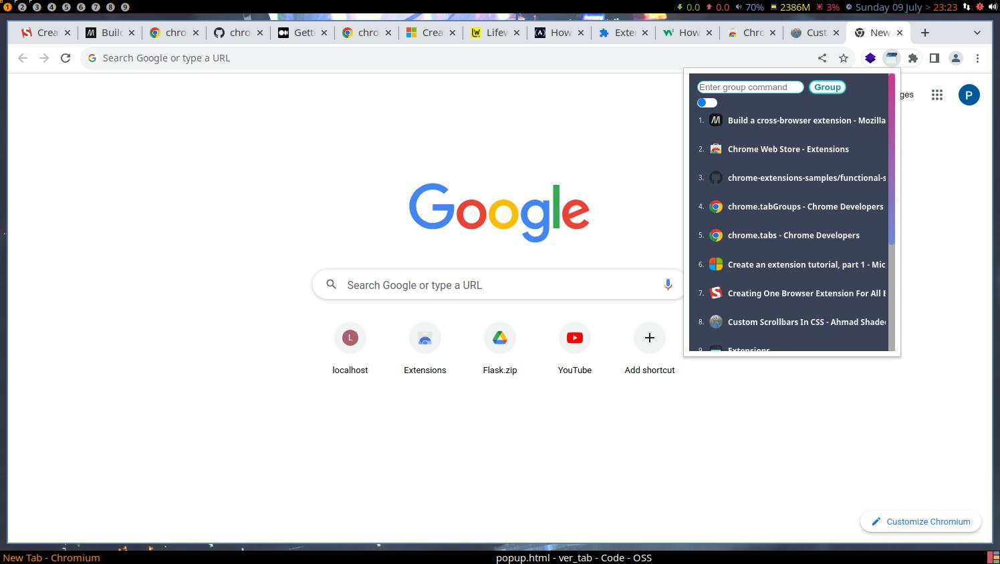

# Tab Manager Chrome Extension

The Tab Manager Chrome Extension is a powerful tool that helps you organize and manage your browser tabs with ease. It allows you to create tab groups, collapse the tab list for a clutter-free view, and quickly navigate to specific tabs.

## Features

- **Tab Groups**: Create custom groups of tabs to organize your browsing sessions.
- **Collapsible Tab List**: Collapse the tab list to free up space and focus on the active tabs.
- **Quick Navigation**: Click on a tab to navigate to it instantly.

## Installation

1. Clone the repository or download the source code as a ZIP file.
2. Open Google Chrome and go to the "Extensions" page (`chrome://extensions/`).
3. Enable "Developer mode" in the top-right corner.
4. Click on "Load unpacked" and select the directory where you cloned/downloaded the source code.
5. The Tab Manager Chrome Extension should now be installed and visible in the extensions list.

## Usage

1. Open a new tab in Google Chrome.
2. Click on the Tab Manager extension icon in the browser toolbar.
3. The Tab Manager sidebar will open, displaying the list of open tabs.

4. Use the input field to execute group commands and click the "Group" button or press "Enter" to create tab groups. Below are the available commands:

- `group -t 1,2,5 -n Group 1` 
--> Create a group with tabs 1, 2, and 5 and name it "Group 1".
- `group -t 1-5 -n Group 2` 
--> Create a group with tabs 1 to 5 and name it "Group 2".
- `group -t 1,2,5` 
--> Create a group with tabs 1, 2, and 5 without a name.

5. Click on a tab in the sidebar to navigate to it instantly.

## Contributing

Contributions are welcome! If you have any ideas, bug reports, or feature requests, please open an issue or submit a pull request.

## License

The Tab Manager Chrome Extension is released under the [MIT License](LICENSE).

